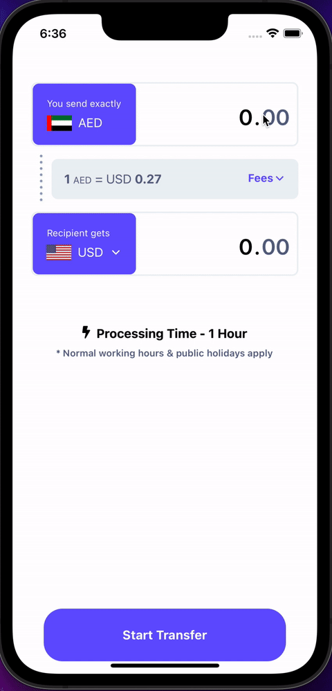
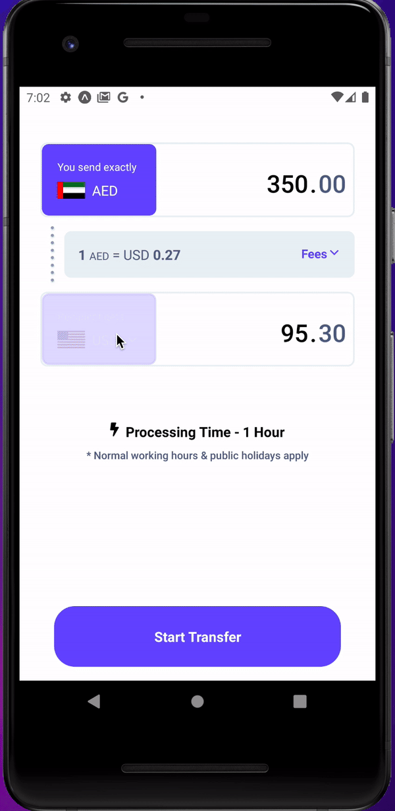

# Send Money App

## Overview

This is a mobile application built with Expo. The app uses `Yarn workspaces` to run a server as a package that can be mocked or use another real endpoint to get the data from.

## Table of Contents

- [Installation](#installation)
- [Prerequisites](#prerequisites)
- [Running the Project](#running-the-project)
- [Troubleshoot](#troubleshoot)
- [Test](#test)
- [Docs](#docs)

## Installation ⚙️

Before you begin, make sure you have [Node.js](https://nodejs.org/) installed on your machine.

1. Clone the repository:

```bash
git clone https://github.com/yayobyte/send-money-app
cd send-money-app
```

2. Install dependencies

```bash
yarn install
```

## Prerequisites 🪜
Get the `accessKey` token from @yayobyte to use the `http://currencylayer.com` live server and edit the file:
```bash
packages/server/config.js
```
otherwise the rates will be mocked using the file
```bash
packages/server/rates.json
```

## Running the project 🏎️
Start the server (mock or live). This command will start nodemon and will run the backend api to serve the currency exchange rates to the frontend app. By default it will create a `middleware` server in `http://localhost:3001`
```bash
yarn run server
```

In another console, start the development server
```bash
npx expo start 
```

## Troubleshoot 📞
1. If you face issues connecting to your localhost server:
```bash
Error during GET request: [TypeError: Network request failed]
```
try changing `http://localhost` for the current ip given by your local router i.e. `http://192.168.1.3`. The configuration is located in the file:
```bash
api/ApiService.ts
```

2. If you encounter issues running the ios simulator, make sure you have installed the latest version of xcode
```bash
› Opening on iOS...
Error: xcrun exited with non-zero code: 2
An error was encountered processing the command (domain=NSPOSIXErrorDomain, code=2):
Unable to boot device because we cannot determine the runtime bundle.
No such file or directory
```

try installing xcode-select
```bash
xcode-select --install
```

and then setting the correct path to Xcode
```bash
sudo xcode-select --switch /Applications/Xcode.app
```

## Test 🎯
1. To run `Unit` test for the business logic functions please run:
```bash
yarn run test
```

## Docs 📚

Here is a small demo of the app. If you are not able to see this behaviour please refer to the Troubleshoot section.

> The App has been tested in physical multiple devices and simulators, take a look at the following videos 

### Iphone 14 Simulator


### Iphone 12 Pro Physical Device


### Android Simulator

